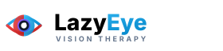

# 👁️ LazyEye — Digital Dichoptic Vision Therapy Platform

<p align="center">
  
  <br>
  <strong>A full-stack clinical rehabilitation platform for Amblyopia (Lazy Eye) treatment using interactive dichoptic games and anaglyph red-cyan filtering.</strong>
</p>

<p align="center">
  <a href="https://lazyeye.onrender.com" target="_blank"></a>
  
  
  
  
</p>

---

## 🌐 Live Platform

The application is deployed and live at:  
👉 **[https://lazyeye.onrender.com](https://lazyeye.onrender.com)**

---

## 📚 Complete Project Documentation

Detailed technical and deployment guides have been compiled in the [`docs/`](docs/) directory:

1. 📖 [**Project Architecture, Structure & User Levels**](docs/PROJECT_STRUCTURE_AND_USER_LEVELS.md)
   - Complete file-by-file directory explanation.
   - Comprehensive **5-tier role system**: `root` Superadmin, `admin` Clinic Administrator, `doctor` Optometrist / Vision Therapist, `user` Enrolled Patient, and `Unpaid User`.
   - Feature permission matrix and database ER diagrams.
   - Clinical lifecycle sequence flow from registration to therapy completion.

2. 🚀 [**Build, Release & Render Deployment Guide**](docs/BUILD_AND_DEPLOYMENT_GUIDE.md)
   - Local asset build pipeline (`npm run dev` / `npm run prod`).
   - Git push and version control workflow.
   - Step-by-step Render configuration (Docker runtime, environment variables, Apache DocumentRoot).
   - HTTPS proxy termination and mixed-content troubleshooting.

---

## 🎮 Therapy Games Included

The platform includes **10 interactive HTML5/Canvas dichoptic vision therapy games**:
- **Snake Game** (`/game1snake`): Non-dominant eye macular fixation and dual-channel fusion.
- **Flappy Bird** (`/game2flappybird`): High-frequency saccades and altitude depth judgment.
- **Menja 3D** (`/game12menja`): Dynamic 3D block slicing challenge stimulating visual reflexes.
- **Tetris Fusion** (`/game8tetris`): Dichoptic pattern alignment and spatial orientation.
- **Bubble Shooter** (`/game9bubbleshooter`): Foveal aiming and peripheral stereoscopic acuity.
- **Ping-Pong 3D** (`/game10pingpong`): Dynamic velocity tracking and reaction agility.
- **Sticky Holds** (`/game11stickyholds`): Rock climbing agility puzzle demanding sustained binocular fusion.
- **Maze Labyrinth** (`/game5maze`): Split-cue maze navigation.
- **Ball Catcher** (`/game3ballcatcher`): Hand-eye motor coordination.
- **Bouncing Ball** (`/game7test`): Dynamic trajectory prediction under dichoptic viewing.

---

## ⚡ Quick Start (Local Setup)

```bash
# 1. Clone repository
git clone https://github.com/abhipal-dev/lazyEye.git
cd lazyEye

# 2. Install PHP and JS dependencies
composer install
npm install

# 3. Compile frontend assets
npm run dev

# 4. Configure environment
cp .env.example .env
php artisan key:generate

# 5. Start development server
php artisan serve
```

Visit `http://localhost:8000` in your browser.

---

## 🔒 License
This project is proprietary and maintained by [abhipal-dev](https://github.com/abhipal-dev).
