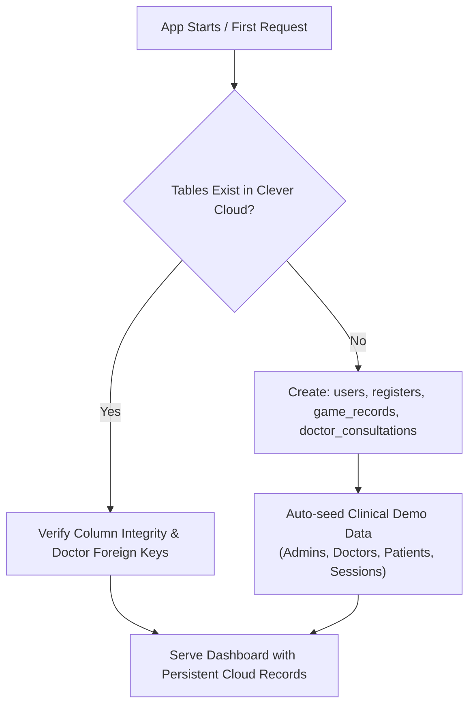

# LazyEye - Cloud Database & Deployment Guide

This guide documents the **Clever Cloud MySQL** database configuration, **Render Web Service** deployment steps, environment variables, and essential service links for the **LazyEye** vision therapy platform.

---

## 1. Clever Cloud MySQL Database Credentials (Paris, Europe)

Your ultra-fast European cloud MySQL database is hosted on **Clever Cloud (Free Dev Tier - Paris)**:

| Parameter | Value | Laravel Environment Variable |
| :--- | :--- | :--- |
| **Database Engine** | MySQL 8.x | `DB_CONNECTION=mysql` |
| **Host** | `bpzssackelkqaw4zq5x3-mysql.services.clever-cloud.com` | `DB_HOST` |
| **Port** | `3306` | `DB_PORT` |
| **Database Name** | `bpzssackelkqaw4zq5x3` | `DB_DATABASE` |
| **User** | `bpzssackelkqaw4zq5x3` | `DB_USERNAME` |
| **Password** | *(Copy from Clever Cloud Dashboard)* | `DB_PASSWORD` |

> [!TIP]
> **Where to find your Password**: In your [Clever Cloud Console](https://console.clever-cloud.com/), click on your MySQL add-on `bpzssackelkqaw4zq5x3` $\to$ **Environment Variables** (or click the blue **"Export Environment Variables"** button in the top-right corner) and copy the value of `MYSQL_ADDON_PASSWORD`.

---

## 2. Render Environment Variables (Copy & Paste)

To connect your live application on Render to your new Clever Cloud MySQL Paris database, update your Render Environment:

### Instructions:
1. Log into your **[Render Dashboard](https://dashboard.render.com/)**.
2. Click on your Web Service: **`lazyeye`**.
3. In the left navigation sidebar, select **Environment**.
4. Set or update the following values:

```ini
APP_NAME=LazyEye
APP_ENV=production
APP_KEY=base64:jYOrxjekOb0B1hmZbwZnKmKuy2L4rqLXtkOx8Wu0aVk=
APP_DEBUG=false
APP_URL=https://lazyeye.onrender.com
LOG_CHANNEL=stderr

DB_CONNECTION=mysql
DB_HOST=bpzssackelkqaw4zq5x3-mysql.services.clever-cloud.com
DB_PORT=3306
DB_DATABASE=bpzssackelkqaw4zq5x3
DB_USERNAME=bpzssackelkqaw4zq5x3
DB_PASSWORD=<PASTE_YOUR_CLEVER_CLOUD_PARIS_PASSWORD_HERE>

SESSION_DRIVER=cookie
SESSION_LIFETIME=10080
```

5. Click the blue **Save Changes** button at the bottom of the page.
6. Render will automatically apply the changes and reconnect.

---

## 3. Automated Database Setup (Zero Manual SQL Import)

You **do not need to manually import any `.sql` file** into Clever Cloud. The codebase features a built-in self-healing schema manager (`UserController::ensureDatabaseReady()`):



### Self-Healing Features:
1. **Auto-Table Creation**:
   * `users`: Stores patient, doctor, and admin profiles, eye calibrations, and allotted session times.
   * `registers`: Stores self-registered accounts awaiting admin/doctor approval.
   * `game_records`: Normalized high-performance table storing therapy game sessions, scores, durations, and UTC timestamps.
   * `doctor_consultations`: Clinical evaluations, prescribed vision therapy regimens, and doctor consultation notes.
2. **Instant Demo Seeder Button**:
   * On the Admin/Doctor Dashboard, click the **`[⚡ Seed Demo Data]`** button anytime to instantly populate 4 patients, 2 doctors, 2 admins, 42 game sessions, and 3 consultations.
   * Or directly visit: `https://lazyeye.onrender.com/seedDemoData`

---

## 4. Default Clinical Accounts & Credentials Data

Below is the complete dataset of pre-seeded user accounts available immediately upon database initialization:

### 🏥 Medical Staff & Administrators

| Role | Full Name | Username | Password | Email | Daily Goal |
| :--- | :--- | :--- | :--- | :--- | :--- |
| **Admin** | Clinical Administrator | `admin` | `admin123` | `admin@lazyeye.org` | 20 min |
| **Admin** | Pranjal Agarwal | `pranjal` | `4567` | `pranjalagarwal@gmail.com` | 20 min |
| **Doctor** | Dr. Sarah Mitchell, OD | `dr_sarah` | `doctor123` | `sarah.mitchell@lazyeye-clinic.org` | 20 min |
| **Doctor** | Dr. James Vance, FAAO | `dr_vance` | `doctor123` | `james.vance@lazyeye-clinic.org` | 20 min |

### 👁️ Enrolled Vision Therapy Patients

| Full Name | Username | Password | Email | Assigned Doctor | Anaglyph Calibration | Prescribed Target |
| :--- | :--- | :--- | :--- | :--- | :--- | :--- |
| **Abhishek Pal** | `abhi8535` | `9870` | `abhi8535@gmail.com` | Dr. Sarah Mitchell | Blue (L) / Red (R) | 25 min / day |
| **Riya Jaiwal** | `riyajaiwal` | `1234` | `riya@gmail.com` | Dr. Sarah Mitchell | Red (L) / Green (R) | 20 min / day |
| **Shivam Singh** | `singhsaab` | `9999` | `shivam@gmail.com` | Dr. James Vance | Red (L) / Cyan (R) | 15 min / day |
| **Avishi Agarwal** | `avishi` | `avishi` | `avishi@gmail.com` | Dr. James Vance | Red (L) / Blue (R) | 20 min / day |

### ⏳ Pending Registrations (`registers` Table)

| Applicant Name | Username | Password | Email | Status | Action |
| :--- | :--- | :--- | :--- | :--- | :--- |
| **Arun Badhotiya** | `aruna` | `39654` | `arunbadhotiya@gmail.com` | Pending Approval | Click `[Approve]` in Admin Panel |
| **Neha Bhardwaj** | `neha0211` | `0211` | `nehabhardwaj@gmail.com` | Pending Approval | Click `[Approve]` in Admin Panel |
| **Kunal Pal** | `kunal_pal` | `1234` | `kunal@kr.up` | Pending Approval | Click `[Approve]` in Admin Panel |

### 🎮 Pre-Seeded Therapy Sessions (`game_records`)
* **Total Sessions**: 42 clinical therapy sessions.
* **Game Distribution**: Tetris, Snake, Flappy Bird, Menja 3D, Bubble Shooter, Sticky Holds, Ball Catcher, Ping Pong, Bouncing Ball.
* **Score Range**: 15 to 120 points.
* **Session Durations**: 10 to 25 minutes (600s – 1500s) timestamped across the past 7 days.

---

## 5. Complete Step-by-Step Deployment Workflow

### Step 1: Commit and Push Code from Local Machine
Whenever you make updates locally, run:
```bash
# 1. Verify status
git status

# 2. Compile React assets (if JS/CSS was modified)
npm run prod

# 3. Stage changes
git add .

# 4. Commit
git commit -m "Configure persistent cloud database and deploy updates"

# 5. Push to GitHub main branch
git push origin main
```

---

### Step 2: Render Automatic Build & Deployment
Once pushed to `main`:
1. Render receives GitHub's webhook and starts building the Docker container according to [`Dockerfile`](file:///d:/Abhishek_Projects/lazyEye/Dockerfile).
2. The Apache web server starts and points to `/var/www/html/public`.
3. Laravel connects directly to Clever Cloud MySQL on port `3306`.
4. If MySQL is unreachable, the system automatically falls back to SQLite seamlessly.
5. The deployment becomes live at: **[https://lazyeye.onrender.com](https://lazyeye.onrender.com)**.

---

### Step 3: Verify Live Deployment
1. Open **[https://lazyeye.onrender.com](https://lazyeye.onrender.com)** in your browser.
2. Log into the Admin panel using:
   * **Username**: `admin`
   * **Password**: `admin123`
   *(Or log into a patient account with `abhi8535` / `9870`)*
3. Verify that the Dashboard displays active patients, doctors, and game records.
4. Play any game or complete a Tumbling 'E' Visual Acuity test from a patient account.
5. Exit fullscreen or click **`[ Finish Therapy & Save ]`** $\to$ observe the record permanently saved to Clever Cloud MySQL.

---

## 6. Essential Service Links

| Service | Purpose | URL |
| :--- | :--- | :--- |
| **Live Web App** | Production Application URL | [https://lazyeye.onrender.com](https://lazyeye.onrender.com) |
| **Render Dashboard** | Manage Web Service, Logs & Environment | [https://dashboard.render.com](https://dashboard.render.com) |
| **Clever Cloud Console** | Cloud MySQL Database Console & Metrics | [https://console.clever-cloud.com](https://console.clever-cloud.com) |
| **GitHub Repository** | Source Code & Version Control | [https://github.com/abhipal-dev/lazyEye](https://github.com/abhipal-dev/lazyEye) |
| **Seed Demo Data Route** | Manual Database Re-Seeding Trigger | [https://lazyeye.onrender.com/seedDemoData](https://lazyeye.onrender.com/seedDemoData) |

---

## 7. Troubleshooting & Diagnostics

### Q: Why does Render take 30-50 seconds to open the website on first click?
* **A**: Render's Free tier puts inactive containers to sleep after 15 minutes of idle time. The first request wakes the container up (a "cold start"). Subsequent requests are fast. With our `SESSION_DRIVER=cookie` upgrade, your login session will remain active across cold starts.

### Q: How do I check if Render is connected to Clever Cloud properly?
* In the Render Dashboard, open your service $\to$ click the **Logs** tab. If the database credentials are valid, Apache starts cleanly with `apache2-foreground` and logs HTTP `200` requests. If credentials are wrong, Laravel will log a `PDOException` in red text.

### Q: How do I back up my database?
* In the [Clever Cloud Console](https://console.clever-cloud.com/), open your MySQL add-on $\to$ click **Backups** tab to download automated daily snapshots of your database at any time.

