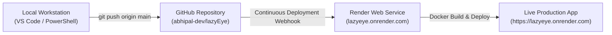

# LazyEye - GitHub Account & Repository Guide

This document details the GitHub account configuration, repository details, authentication procedures, and daily development workflows for the **LazyEye** vision therapy project.

---

## 1. GitHub Account & Repository Details

| Property | Details / Value |
| :--- | :--- |
| **GitHub Username** | `abhipal-dev` |
| **Git Committer Email** | `abhipal85350@gmail.com` |
| **Repository Name** | `lazyEye` |
| **Repository Web URL** | [https://github.com/abhipal-dev/lazyEye](https://github.com/abhipal-dev/lazyEye) |
| **Git Clone URL (HTTPS)** | `https://github.com/abhipal-dev/lazyEye.git` |
| **Git Clone URL (SSH)** | `git@github.com:abhipal-dev/lazyEye.git` |
| **Primary Production Branch** | `main` |
| **Deployment Integration** | Connected to **Render** Web Service (`lazyeye`) |

---

## 2. Local Git Configuration

To verify or configure your local machine so commits are attributed to your GitHub account:

```bash
# Set your global or repository-level username
git config user.name "abhipal-dev"

# Set your email (must match your GitHub account email)
git config user.email "abhipal85350@gmail.com"

# Verify current git configuration
git config user.name
git config user.email

# Verify your remote repository link
git remote -v
```

Expected output for `git remote -v`:
```text
origin  https://github.com/abhipal-dev/lazyEye.git (fetch)
origin  https://github.com/abhipal-dev/lazyEye.git (push)
```

---

## 3. GitHub Authentication (Personal Access Token)

GitHub requires a **Personal Access Token (PAT)** instead of your plain account password when pushing over HTTPS.

### How to Generate a Personal Access Token on GitHub:
1. Log into GitHub: [https://github.com/](https://github.com/)
2. Click your profile avatar (top-right) $\to$ **Settings**.
3. Scroll down the left sidebar and click **Developer settings** (at the very bottom).
4. Click **Personal access tokens** $\to$ **Tokens (classic)**.
5. Click **Generate new token** $\to$ **Generate new token (classic)**.
6. Set:
   * **Note**: `LazyEye Deploy Token`
   * **Expiration**: `90 days` (or `No expiration` for personal development)
   * **Select scopes**: Check the **`repo`** checkbox (grants full repository access).
7. Click **Generate token** at the bottom.
8. **Copy and save your token** (`ghp_xxxxxxxxxxxxxxxxxxxx`). *GitHub will only show this token once.*

### Using Your Token on Windows:
When running `git push origin main` in PowerShell or Command Prompt:
* **Username**: `abhipal-dev`
* **Password**: Paste your Personal Access Token (`ghp_...`).
* Windows Git Credential Manager will securely remember this token so you won't need to re-enter it each time.

---

## 4. Daily Development & Push Workflow

Whenever you make changes to frontend React components, Blade templates, or Laravel controllers:

```bash
# Step 1: Check which files have been modified or created
git status

# Step 2: Compile frontend React and SCSS assets (if frontend was modified)
npm run prod

# Step 3: Stage your modified files
git add .

# Step 4: Commit with a descriptive message
git commit -m "Update clinical dashboard and add persistent database configuration"

# Step 5: Push directly to main (triggers automated Render deployment)
git push origin main
```

---

## 5. How GitHub Connects to Render



* **Automated Webhooks**: Render is connected directly to `abhipal-dev/lazyEye`.
* **Zero-Downtime Deploy**: Whenever a commit is pushed to the `main` branch, Render automatically detects it, pulls the code, executes the `Dockerfile`, and serves the new version.
* **Rollbacks**: If a bug is ever introduced, you can roll back to any previous commit from the Render dashboard or by running `git revert <commit-hash> && git push origin main`.
