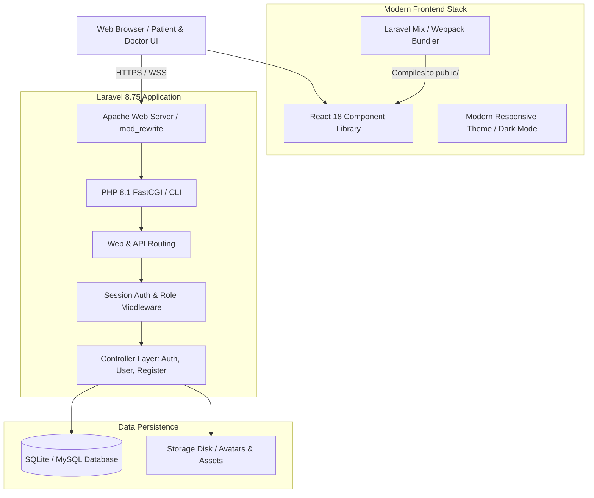
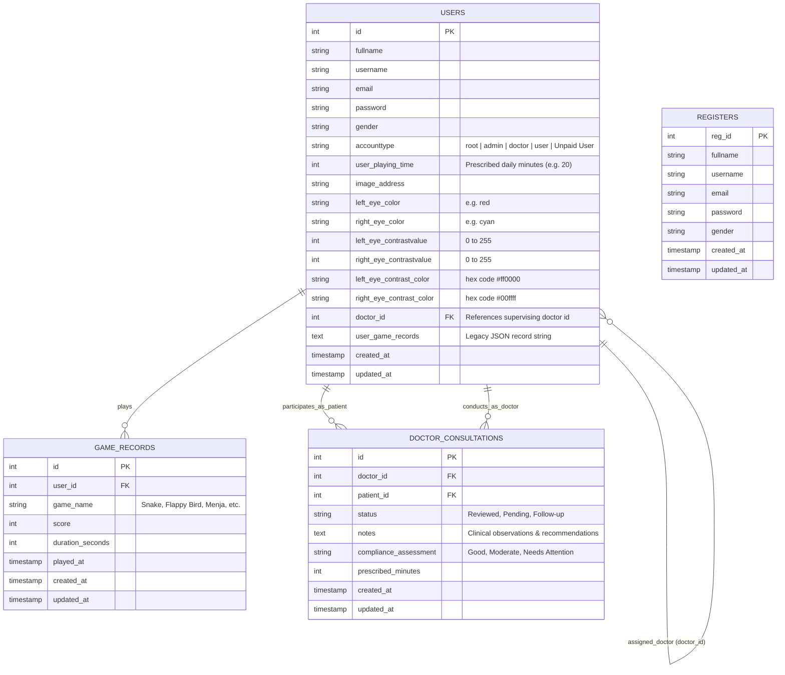
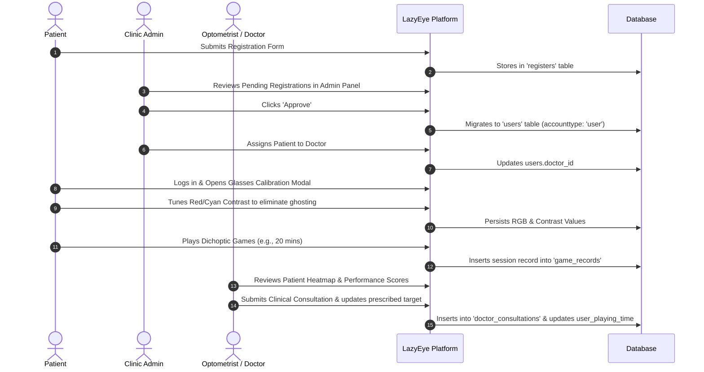

# LazyEye — Project Architecture & User Role Specification

> **Platform Overview**: LazyEye is a specialized web-based visual rehabilitation platform designed to treat **Amblyopia** (commonly known as "Lazy Eye") using digital **Dichoptic Therapy**. By utilizing red-cyan anaglyph glasses and customized chromatic/contrast separation, the platform presents distinct visual cues to each eye simultaneously. This forces the patient's visual cortex to combine input from both eyes, effectively breaking neural suppression and stimulating binocular fusion.

---

## 1. System Architecture & Tech Stack



### Technology Matrix
- **Backend Framework**: Laravel 8.75 (PHP 8.1)
- **Web Server**: Apache 2.4 with `mod_rewrite` enabled
- **Database**: SQLite (Production on Render) / MySQL compatible (via PDO)
- **Frontend Core**: React 18.2, JavaScript ES6+, JSX
- **Styling**: Bootstrap 5, Custom Design Tokens (`modern-theme.css`), Font Awesome 6
- **Build Tooling**: Laravel Mix 6 (Webpack 5, PostCSS, Babel React Preset)
- **Containerization**: Docker (Debian-based official PHP 8.1 Apache image)

---

## 2. Directory & File Breakdown

Below is a comprehensive inventory of the codebase detailing what each file and folder does.

```
lazyEye/
├── app/                      # Core PHP application logic
│   ├── Console/              # Artisan commands & scheduled tasks
│   ├── Exceptions/           # Global exception handler
│   ├── Http/                 # Controllers, Middleware & HTTP Kernel
│   ├── Models/               # Eloquent ORM database models
│   └── Providers/            # Application service providers
├── bootstrap/                # Framework initialization & autoload caches
├── config/                   # Configuration files (app, database, session, etc.)
├── database/                 # SQLite database file, migrations & seeders
├── docs/                     # Technical documentation & guides
├── public/                   # Web root accessible by Apache (compiled assets, static files)
├── resources/                # Source code for React frontend, Blade views & CSS
├── routes/                   # Routing declarations (web, api, console, channels)
├── storage/                  # Generated caches, logs, uploaded user profile images
├── .dockerignore             # Files excluded from Docker builds
├── composer.json             # PHP backend package dependencies
├── Dockerfile                # Production Docker container build instructions
├── package.json              # Node.js frontend dependencies & build scripts
└── webpack.mix.js            # Laravel Mix configuration compiling React to public/
```

### Detailed File Guide

#### `app/Http/Controllers/`
- **`AuthController.php`**: Handles user authentication workflows:
  - `login()`: Validates credentials against the `users` table, establishes HTTP sessions (`loggedInUser`, `loggedInUserName`, `loggedInUserType`), and redirects users based on their privilege level.
  - `logout()`: Flushes session data and logs the user out.
  - `admin()`: Renders the administrator / clinical view (`adminPanel.blade.php`).
  - `user_view()`: Renders the patient therapy portal (`userPanel.blade.php`).
- **`UserController.php`**: The central controller for administrative, doctor, and patient operations:
  - `fetchDashboardStats()`: Aggregates metrics (active patient count, doctor count, compliance percentages, weekly session counts, game distribution).
  - `fetchUsers()`: Queries active patients joined with their assigned doctor's details.
  - `fetchDoctors()`: Retrieves all registered medical staff and therapists.
  - `fetchAdmins()`: Retrieves all system and clinic administrators (`admin`, `root`).
  - `fetchRegisters()`: Retrieves pending user registration applications.
  - `createUser()`: Allows administrators to create pre-configured user accounts directly.
  - `assignDoctor()`: Associates a specific patient with a supervising doctor.
  - `logConsultation()`: Records medical review notes, compliance ratings, and updates prescribed therapy minutes.
  - `fetchConsultations()`: Retrieves historical clinical notes for a given patient or doctor.
  - `saveGameRecords()`: Records session duration, dichoptic score, and game name into the normalized `game_records` table.
  - `fetchGameRecords()`: Returns chronological session records for performance analysis.
  - `saveColorSettings()`: Persists patient-calibrated anaglyph RGB hex values and contrast levels.
  - `approve()`: Upgrades a pending registration record into an active patient account.
  - `delete()`: Removes accounts or pending registration requests.
  - `update()`: Updates user profiles, passwords, daily allocated therapy time, or assigned roles.
- **`RegisterController.php`**: Handles public registration form submissions and validation.
- **`UploadImageController.php`**: Manages profile image uploads, validation, and storage to `public/storage/images/`.

#### `app/Http/Middleware/`
- **`TrustProxies.php`**: Configured with `$proxies = '*'` to trust reverse proxies (e.g. Render, Cloudflare, load balancers), ensuring proper HTTPS detection.
- **`loginCheck.php`**: Route middleware that prevents unauthenticated access to restricted portals and redirects guests to login.
- **`VerifyCsrfToken.php`**: Protects POST/PUT requests from Cross-Site Request Forgery attacks.

#### `app/Providers/`
- **`AppServiceProvider.php`**: Enforces HTTPS URL scheme (`URL::forceScheme('https')`) when running in production or behind SSL termination.
- **`RouteServiceProvider.php`**: Binds controller routes and defines the home redirect path.

#### `app/Models/`
- **`User.php`**: Eloquent model representing accounts in the `users` table (credentials, accounttype, calibration values, allocated time).
- **`Register.php`**: Eloquent model representing applicants in the `registers` table.

#### `routes/`
- **`routes/web.php`**: Declares all application routes, including:
  - Public endpoints: `/Login_req`, `/Register_req`, `/fetchLoginUser`
  - Authenticated clinical routes: `/admin`, `/user`, `/dashboard`, `/fetchDashboardStats`, `/fetchUsers`, `/fetchDoctors`, `/assignDoctor`, `/logConsultation`, etc.
  - Therapy game views: `/game1snake`, `/game2flappybird`, `/game3ballcatcher`, `/game5maze`, `/game6bricksbreaker`, `/game8tetris`, `/game9bubbleshooter`, `/game10pingpong`, `/game11stickyholds`, `/game12menja`.

#### `resources/js/components/` (React Frontend)
- **`AdminPanel.js`**: Master navigation wrapper for administrators and doctors. Provides sidebar navigation, responsive mobile toggling, user profile management, and role-aware navigation.
- **`UserDashboard.js`**: Patient therapy portal. Contains tabs for games, glasses calibration, clinical activity logs, and personal reports.
- **`Dashboard.js`**: Executive KPI overview containing metrics cards (Total Patients, Active Doctors, Clinical Reviews, Weekly Sessions chart, and Game Distribution stats).
- **`Table.js`**: Interactive data management table supporting tab switching between Active Patients, Doctors & Staff, Clinical Reviews, Pending Registrations, and Administrators, with inline search, doctor assignment modal, and consultation review forms.
- **`Games.js`**: Visual therapy library displaying a featured game carousel and interactive cards for all 10 dichoptic games, including prescribed minutes and therapy focus tags.
- **`ActivityLog.js`**: Heatmap calendar component (similar to GitHub contributions) rendering patient training frequency and streak metrics.
- **`ProgressReport.js`**: Patient progress reporting dashboard visualizing performance scores, training consistency, and clinical compliance over time.
- **`Login.js` & `Register.js`**: Authenticated interface forms with validation, error handling, and sweetAlert notifications.
- **`ThemeToggle.jsx`**: Global dark/light theme switch persisting preferences to `localStorage`.
- **`modals/UserDetailsModal.js`**: Modal allowing users to review their profile details and change passwords.
- **`modals/ImageUploadModal.js`**: Modal handling avatar uploads with live preview.

#### `resources/views/` (Blade Templates)
- **`welcome.blade.php`**: Public landing page mounting the React authentication components (`#loginRoot`, `#registerRoot`).
- **`adminPanel.blade.php`**: Host template mounting `<div id="adminPanel"></div>` and the React admin bundle.
- **`userPanel.blade.php`**: Host template mounting `<div id="userPanel"></div>` and the React patient bundle.
- **`game*.blade.php` / `.php`**: Dedicated HTML5 Canvas / WebGL game view templates with built-in anaglyph red-cyan shaders and score submission hooks back to `/SaveGameRecords`.

#### `public/`
- **`public/css/modern-theme.css`**: Design tokens, variables (light/dark mode), responsive utilities, and custom card styles.
- **`public/js/app.js`**: Compiled bundle generated by Laravel Mix containing React, ReactDOM, and all component libraries.
- **`public/js/theme.js`**: Theme initialization script running early to prevent dark/light theme flash of unstyled content.
- **`public/images/`**: High-resolution therapy game mascot SVGs, illustrations, and default user avatars.

---

## 3. Database Schema & Data Models

The platform operates on 4 key tables:



---

## 4. User Levels & Role Hierarchy

LazyEye implements a strict **5-Tier Role System** tailored for vision clinics, hospitals, and patients.

| Capability / Feature | Root Superadmin (`root`) | Clinic Administrator (`admin`) | Vision Therapist (`doctor`) | Enrolled Patient (`user`) | Unpaid / Pending Applicant |
| :--- | :---: | :---: | :---: | :---: | :---: |
| Access Public Landing & Info | Yes | Yes | Yes | Yes | Yes |
| Launch Dichoptic Therapy Games | Yes | Yes | Yes | Yes | No (Locked) |
| Glasses Contrast Calibration | Yes | Yes | Yes | Yes | No |
| Personal Activity Heatmap & Metrics | Yes | Yes | Yes | Yes | No |
| Access Admin Panel & KPIs | Yes | Yes | Yes (Doctor Portal) | No | No |
| View All Patients & Progress | Yes | Yes | Assigned Patients | No | No |
| Assign Patients to Doctors | Yes | Yes | No | No | No |
| Log Clinical Consultations | Yes | Yes | Yes | No | No |
| Modify Prescribed Therapy Target | Yes | Yes | Yes | No | No |
| Approve Pending Registrations | Yes | Yes | No | No | No |
| Delete User / Staff Records | Yes | Yes | No | No | No |
| Create / Promote Staff Accounts | Yes | Yes (Doctor/Admin) | No | No | No |
| Server / Root System Oversight | Yes | No | No | No | No |

---

### In-Depth Role Descriptions

### 1. `root` — Master Superadministrator
- **Description**: The top-level administrative account with unrestricted authority over the entire platform, infrastructure, and database.
- **Key Responsibilities**:
  - Full system oversight, server health, and platform database integrity.
  - Ability to escalate, modify, or demote any account role (including other admins).
  - Ability to delete or purge records across all tables.
  - Simulating patient view directly via the embedded Patient Therapy switch.

### 2. `admin` — Clinic Administrator
- **Description**: Clinic operations manager responsible for managing medical staff, patient admissions, and institutional metrics.
- **Key Responsibilities**:
  - **Patient Onboarding**: Reviewing pending registration requests in the `registers` table and approving them into active `user` accounts.
  - **Staff Management**: Creating and editing doctor accounts (`doctor`) and administrator accounts (`admin`).
  - **Doctor Assignment**: Linking each active patient with an optometrist or vision therapist.
  - **Clinic Analytics**: Monitoring patient compliance rates, daily game distribution, and weekly therapy completion hours.

### 3. `doctor` — Optometrist / Vision Therapist
- **Description**: Clinical healthcare provider overseeing patient therapy plans, compliance, and binocular recovery.
- **Key Responsibilities**:
  - **Clinical Consultation Logging**: Recording clinical observations, visual acuity updates, and compliance notes.
  - **Prescription Adjustment**: Updating the patient's daily target therapy duration (`user_playing_time`, e.g., 20 minutes/day).
  - **Progress Monitoring**: Tracking patient game scores, session frequency, and dichoptic endurance.
  - **Targeted Therapy**: Reviewing patient activity heatmaps to verify consistent daily therapy completion.

### 4. `user` — Enrolled Patient
- **Description**: Active patient undergoing amblyopia vision training with prescribed anaglyph glasses.
- **Key Responsibilities**:
  - **Hardware Calibration**: Adjusting red and cyan color sliders and contrast values to match their physical glasses filter wavelengths.
  - **Therapy Sessions**: Playing prescribed dichoptic video games (Snake, Flappy Bird, Tetris Fusion, Menja 3D, etc.).
  - **Compliance Tracking**: Viewing their individual activity heatmap, total time logged, and progress metrics.
  - **Profile Management**: Updating personal avatar and contact information.

### 5. `Unpaid User` / Pending Registration
- **Description**: Newly registered applicant awaiting clinical approval or subscription activation.
- **Permissions**:
  - Account exists in either the `registers` staging table or with `accounttype = 'Unpaid User'`.
  - Restricted from launching therapy games until upgraded to `user` by an administrator.

---

## 5. Clinical Workflow & Patient Journey



